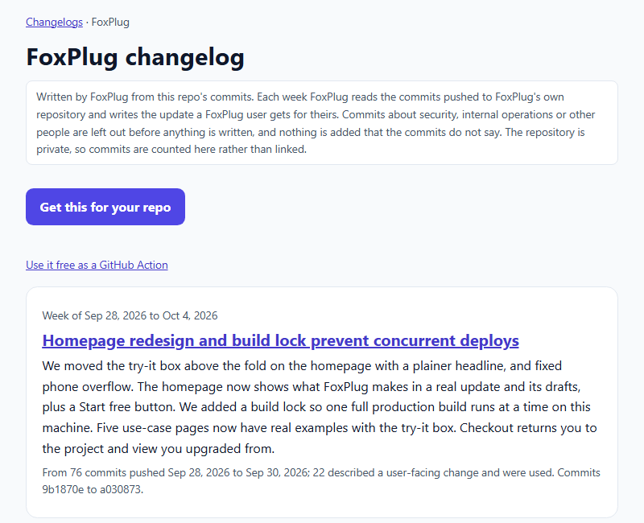

# FoxPlug Changelog and Launch Posts

Every release or push to your main branch becomes a changelog entry and ready-to-post launch updates, waiting in FoxPlug for you to approve.



A live example: [FoxPlug's own changelog](https://foxplug.com/changelog/foxplug/?utm_source=github_marketplace&utm_medium=readme&utm_campaign=changelog_action), written by FoxPlug from its own commits.

Free for one project.

## Set it up

1. **[Get your token](https://foxplug.com/app/?connect=github-action&utm_source=github_marketplace&utm_medium=readme&utm_campaign=changelog_action)**. This opens the GitHub Action row of your FoxPlug project (you sign up or sign in first if you need to). Press **Create a token**. It is shown once.
2. In your repository, open **Settings → Secrets and variables → Actions → New repository secret**. Name it `FOXPLUG_TOKEN` and paste the token.
3. Add this file as `.github/workflows/foxplug.yml`:

```yaml
on: [push, release]
jobs:
  foxplug:
    runs-on: ubuntu-latest
    steps:
      - { uses: OsakaSaul/foxplug-changelog-action@v1, with: { foxplug-token: "${{ secrets.FOXPLUG_TOKEN }}" } }
```

That's it. The next push to your main branch or the next release shows up in FoxPlug as a draft.

## What it does

- **On a release**: sends the release name, notes, tag and link.
- **On a push to the default branch**: sends the subject line of each commit in that push. Pushes to other branches send nothing.
- FoxPlug writes a changelog entry and launch posts from it, in your voice, as drafts. **Nothing is posted until you approve it.**
- The run's log says in one sentence what happened, for example that a draft is waiting, or that this release was already captured.

## What leaves your runner

Only what is listed above: release name, notes, tag and link, or commit subject lines. **Nothing else leaves the runner: no source code, no secrets, no environment.** The script is one file with no dependencies, [index.js](index.js), so you can read every line of it.

## Inputs

| Input | Required | What it is |
| --- | --- | --- |
| `foxplug-token` | yes | Your project token, from the repository's secrets. |
| `project` | no | Your FoxPlug project name, as a check that the token is the one you meant. |
| `github-token` | no | Used only to list the commits of a push with more than 20 of them. The default workflow token is enough. |

## Revoking

Revoke the token in your FoxPlug project at any time; the next run then stops with a message saying so.

## Licence

MIT
